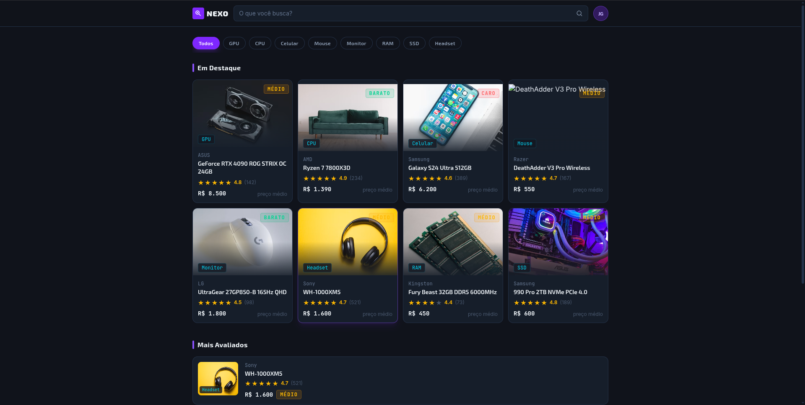
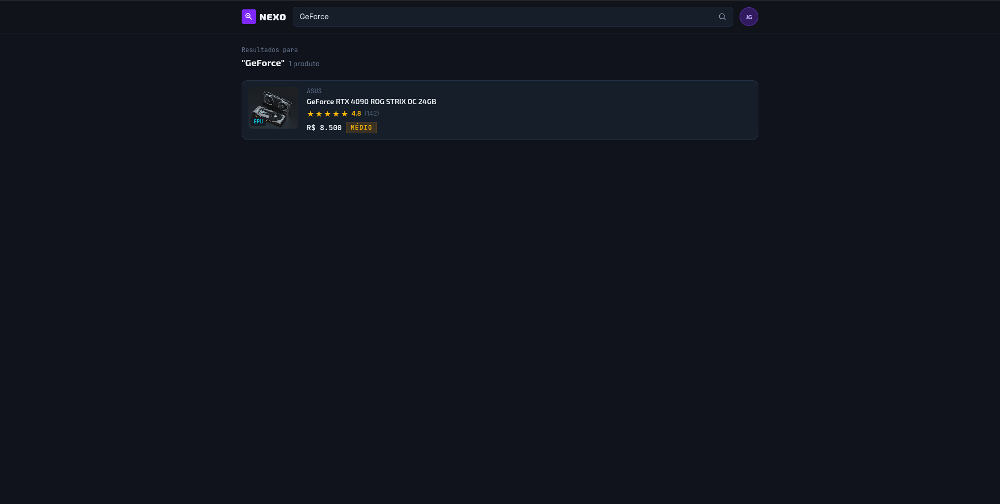
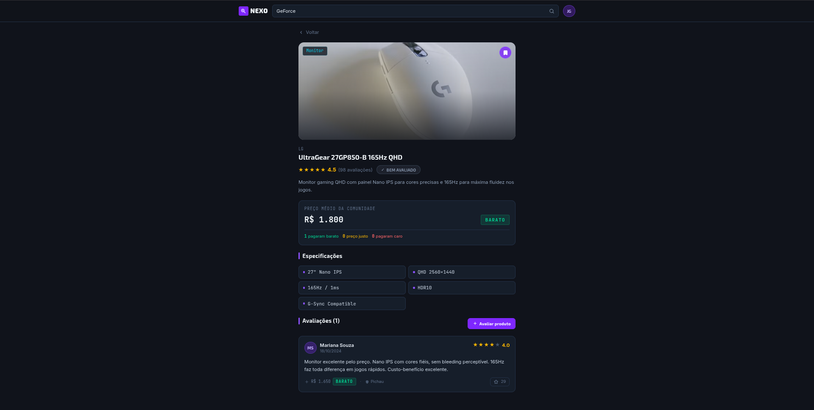
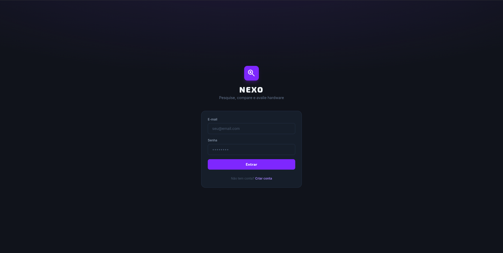
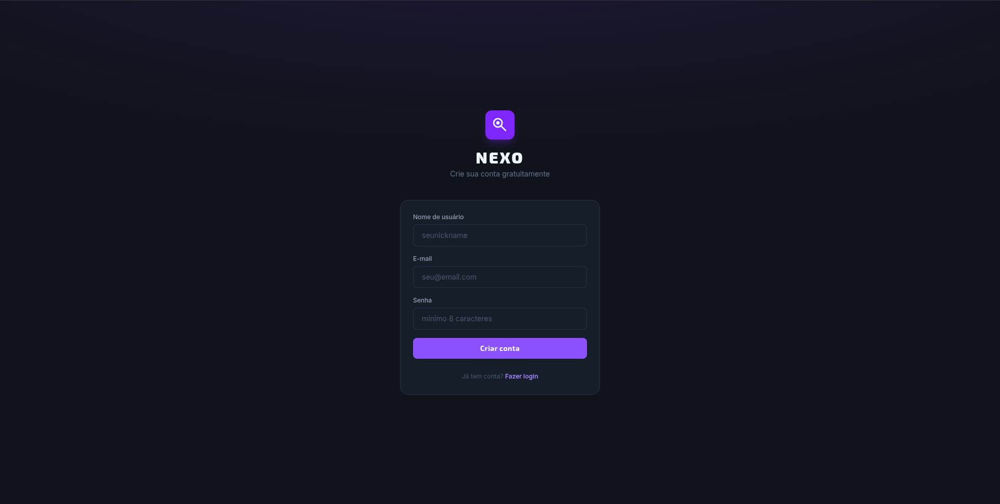
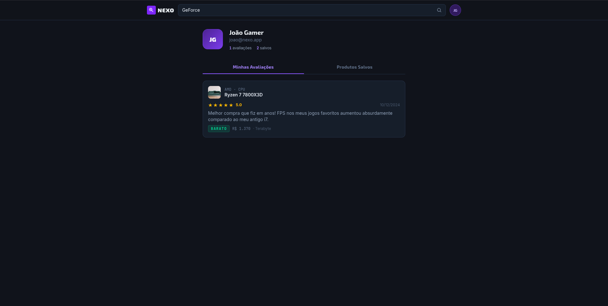

# Nexo

Interface web desenvolvida como projeto de UI/UX, com foco em proporcionar uma experiência simples, organizada e intuitiva para navegação, pesquisa e visualização de conteúdos.


---

## 🎯 Objetivo

O Nexo tem como objetivo apresentar uma interface moderna e intuitiva, permitindo que o usuário navegue pela plataforma, pesquise conteúdos, visualize informações detalhadas e gerencie seu perfil.

O projeto foi pensado considerando princípios de:

- Usabilidade
- Hierarquia visual
- Consistência de interface
- Facilidade de navegação
- Organização das informações
- Experiência do usuário (UX)

---

## 🛠️ Tecnologias utilizadas

- **React** — desenvolvimento da interface
- **TypeScript** — tipagem e segurança no desenvolvimento
- **Vite** — ferramenta de build e servidor de desenvolvimento
- **Tailwind CSS** — estilização da interface
- **pnpm** — gerenciamento de dependências
- **Figma / Figma Make** — prototipação e desenvolvimento

---

## 📌 Funcionalidades

O projeto apresenta as seguintes funcionalidades e telas:

- Página inicial
- Sistema de login
- Cadastro de usuário
- Pesquisa de conteúdos
- Visualização de especificações/detalhes
- Página de perfil do usuário
- Navegação entre as diferentes áreas da aplicação

---

# 🖥️ Telas do projeto

## 🏠 Página Inicial



A página inicial funciona como o principal ponto de entrada da aplicação.

Nela, o usuário pode visualizar os conteúdos disponíveis e acessar diferentes áreas do sistema. A interface utiliza uma organização baseada em cards e elementos visuais para facilitar a identificação e navegação pelos conteúdos.

A página também apresenta a identidade visual do Nexo e serve como ponto central para acessar os recursos da plataforma.

---

## 🔎 Pesquisa



A tela de pesquisa permite que o usuário encontre conteúdos específicos dentro da plataforma.

A interface foi organizada para apresentar os resultados de maneira clara, facilitando a comparação e identificação dos itens encontrados.

Essa tela tem como principal objetivo reduzir o tempo necessário para o usuário encontrar aquilo que procura.

---

## 📋 Especificações



A página de especificações apresenta informações detalhadas sobre um determinado conteúdo e avaliações de outros usuarios

Ela organiza diferentes características e informações em uma estrutura visual que facilita a leitura e compreensão.

O objetivo dessa tela é permitir que o usuário analise as informações antes de tomar uma decisão ou realizar uma ação dentro da plataforma.

---

## 🔐 Login



A tela de login é utilizada para permitir que usuários já cadastrados acessem a plataforma.

O formulário apresenta os campos necessários para autenticação e mantém uma estrutura visual simples, reduzindo possíveis distrações durante o processo de entrada.

---

## 📝 Cadastro



A tela de cadastro permite que novos usuários criem uma conta na plataforma.

O formulário foi estruturado de maneira objetiva, apresentando os campos necessários para criação do usuário e mantendo a mesma identidade visual utilizada nas demais telas.

A consistência entre as telas de login e cadastro facilita a compreensão do fluxo de autenticação.

---

## 👤 Perfil do Usuário



A página do usuário é destinada à visualização e gerenciamento das informações relacionadas ao perfil.

Ela concentra informações do usuário em um espaço próprio, permitindo uma experiência mais personalizada dentro da plataforma.

---

## 🚀 Como executar o projeto

### Pré-requisitos

Antes de executar o projeto, é necessário ter instalado em sua máquina:

- **[Node.js](https://nodejs.org/)** (Recomenda-se utilizar uma versão recente)
- **[pnpm](https://pnpm.io/)**

---

### Passo a passo

### **1. Clonar o repositório**

**Clone o projeto utilizando Git:**

```bash
git clone git@github.com:erickcabrald/EntregavelFrontEnd-UX_UI.git
```
**Entre na pasta do projeto:**
```bash
cd EntregavelFrontEnd-UX_UI
``` 
**Instalar as dependências
Utilize o pnpm para instalar todas as dependências necessárias:**
```bash
pnpm install
``` 
**Executar o projeto
Após a instalação das dependências, inicie o servidor de desenvolvimento:**
```bash
pnpm dev
``` 

